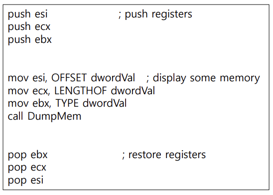
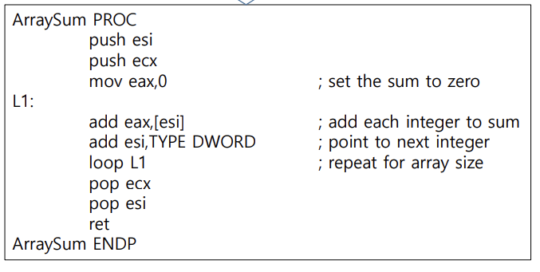
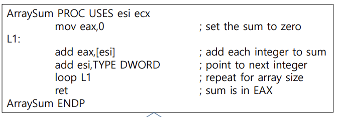
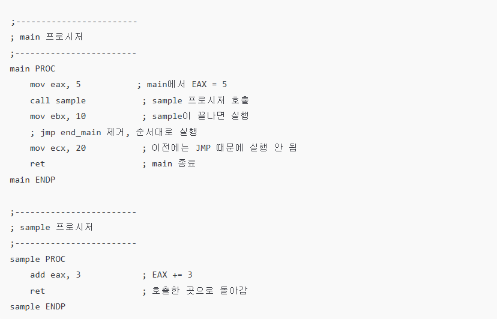
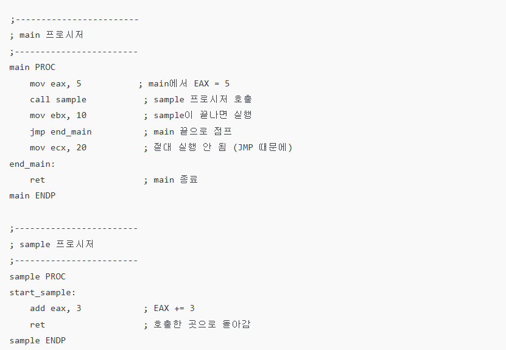
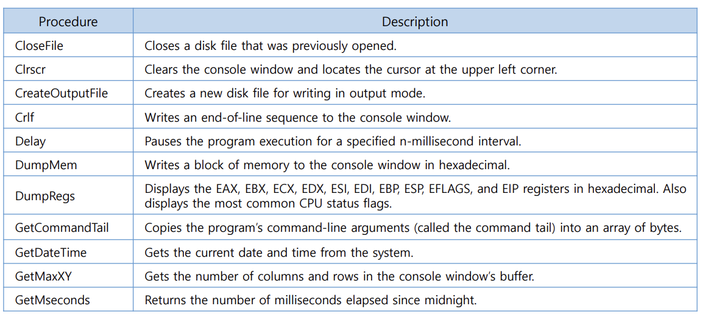
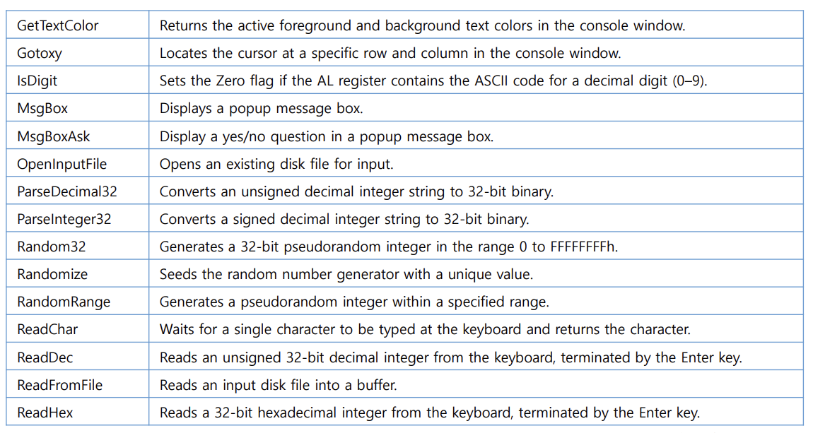
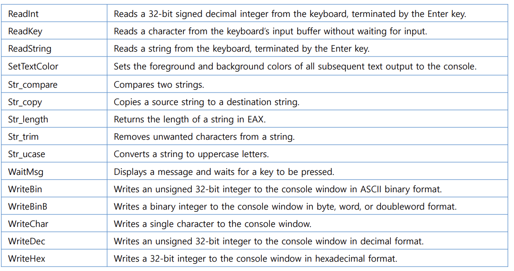

<pre>
- <mark>stack</mark> -
데이터를 일시적으로 저장하는 메모리 구조이며, 마지막에 넣은 데이터가 가장 먼저 나오는(LIFO, Last In First Out) 방식으로 동작합니다.

 
<b>런타임스택</b> -
런타임 스택은 CPU 모드에 따라 크기가 달라지는 메모리 구조입니다. 이때 CPU모드란 CPU가 현재 사용하고 있는 비트 운영 방식이고, 
비트 운영 방식마다 스택 push크기가 바뀌게 됩니다.
 - 64비트 모드 -
 스택 포인터 : RSP
 push 크기   : 8바이트(스택 포인터 감소)   
 pop 크기    : 8바이트(스택 포인터 증가)   
 
 - 32비트 모드 -
 스택 포인터 : ESP
 push 크기   : 4바이트(스택 포인터 감소)
 pop 크기    : 4바이트(스택 포인터 증가)  
 
 - 16비트 모드 -
 스택 포인터 : SP
 push 크기   : 2바이트(스택 포인터 감소)
 pop 크기    : 2바이트(스택 포인터 증가)  

<b>스택 흐름</b> -
Push 명령어는 먼저 ESP || RSP || SP를 감소시키고, 소스 오퍼랜드를 스택에 복사합니다.
반대로 POP 명령어는 먼저 ESP || RSP || SP 가 가리키는 스택 요소의 내용을 해당 비트크기에 맞는 목적지 오퍼랜드에 복사 후 ESP || RSP || SP를 증가 시킵니다.

<b>push, pop목적</b>
PUSH와 POP은 레지스터나 메모리 값을 스택에 저장하고, 필요할 때 스택에서 꺼내 다시 레지스터나 메모리에 복원하는 명령어입니다.
이러한 특성 때문에, 주로 함수나 프로시저를 호출하기 전후에 레지스터 값을 유지할 때 사용됩니다. 다른 레지스터는 저장 목적으로 push, pop
을 사용하는데, ax || Eax || Rax 레지스터는 반환값을 담는 레지스터이므로 push, pop사용은 가능하나, 보통은 사용하지 않습니다.
(ex1)
    

- ESI, ECX, EBX 레지스터에 있던 값들을 먼저 스택에 저장한 뒤, 레지스터에 새로운 값을 넣고 call 명령으로 DumpMem 프로시저로 점프합니다.
DumpMem 내부의 연산을 수행하고 ret을 만나면, 스택에 저장된 리턴 주소로 돌아가 pop EBX부터 실행되며, 이후 pop ECX와 pop ESI를 통해
레지스터들이 원래 값으로 복원됩니다.
 
<b>push, pop 간편 명령어</b> -
PUSHFD - EFLAGS(플래그 레지스터)의 32비트 전체 값을 스택에 저장한다.
POPFD - 스택 맨 위의 32비트 값을 꺼내서 EFLAGS 레지스터에 그대로 복원한다.
 
PUSHAD - EAX → ECX → EDX → EBX → ESP(old) → EBP → ESI → EDI 순서대로 총 8개의 레지스터를 한 번에 스택에 저장하는 명령어
 (4바이트씩 저장, 따라서 총 32바이트 스택 포인터감소)
POPAD - EDI → ESI → EBP → ESP(old 제외) → EBX → EDX → ECX → EAX 순서대로 총 8개의 레지스터를 한 번에 스택에서 꺼내는 명령어
 (4바이트씩 꺼냄, 따라서 총 32바이트 스택포인터 증가)

USES - 프로시저 시작 시 지정한 레지스터 자동 PUSH, 프로시저 끝에서 지정한 레지스터 자동 POP을 해주어
       사용자가 일일이 PUSH/POP 코드를 작성할 필요 없게 해주는 지시어입니다.
(ex1)
     

(ex2)
     

 - ex1는 USES명령어를 사용하지 않고, push, pop을 일일이 적었고, ex2는 USES 지시어를 사용하여 코드 작성을 줄였습니다.

 
- <mark>주소</mark> -
각 데이터는 메모리 안에서 위치를 가지며, 이 위치를 주소라고 부릅니다. 데이터의 주소를 알 수 있는 방법은 OFFSET 연산자 및 &가 있습니다.
OFFSET은 해당 데이터의 시작 주소를 알 수 있고, &는 현재 주소를 알 수 있습니다.

<b> call, jump</b> -
어셈블리에서 call이 호출 되면 다음에 실행될 주소를 스택에 저장 후, call한 데이터 주소로 jump하여 처리합니다. 데이터 주소를 처리 후 ret을 만나면 call이 호출
되었을 떄 스택에 저장된 주소를 jump를 하여 다음 주소를 처리합니다. 여기서 코드의 가독성과 편의성을 챙기기 위해 레이블(label)을 같이 사용합니다. 
(ex1) 
    

(ex2)
    

- ex1은 레이블을 사용하지 않은 버젼이고, ex2는 레이블을 사용한 버젼입니다. 레이블(end_main)을 사용한 버젼이 코드의 
 가독성과 편의성이 좋다라는걸 알 수 있습니다. 
 레이블을 사용할 떄 주의 해야 할점은 프로시저 밖에 레이블을 두는 행위입니다. 만약에 프로시저 밖에 레이블을 둔다면 코드 이해가 어려워지고,
 프로그램 흐름을 뒤섞기 떄문에 오류가 발생 할 수도 있습니다. 그렇기에 프로시저 안에 레이블을 두는 것을 권장합니다.

- <mark>link library</mark> -
link library은 미리 만들어 놓은 함수 묶음 파일입니다.(Irvine32.lib 파일)
명령어를 실행할 떄는 "call 명령어"를 사용하여 미리 만들어 놓은 함수를 사용할 수 있습니다.
(img)
 
 
 
 

</pre>

