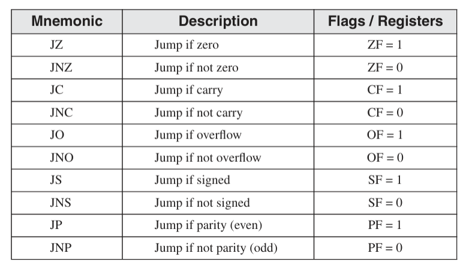
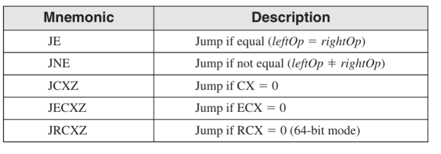

<pre>
- <mark>논리 연산자 및 활용</mark> -

<b>AND</b> -
AND논리 연산자는 두 비트가 0이 하나라도 있으면 0, 모두 1이라면 1이되는 논리 연산자입니다.
AND논리 연산자를 사용하여 cleard(0으로 채움)를 하면 그 비트들은 0, 그리고 unchanged(1로 채움) 해당 비트들의 값이 출력됩니다.
활용 예시는 소문자를 대문자로 바꿀 떄 사용됩니다. 6번째 비트가 1이면 소문자, 0이면 대문자입니다.
그렇기에 소문자의 2진수 값에 AND 1101 1111 논리를 사용하면 대문자의 2진수가 나오게 됩니다.

<b>OR</b> -
OR논리 연산자는 0을 채우면 해당 비트를 가져오고, 1을 채우면 해당 비트를 모두 1로 만듭니다.
OR논리 연산자를 사용하여 unchanged(0으로 채움)을 하면 해당 비트들의 값이, set(1로채움)을 하면 해당 비트가 전부 1로 바뀌게 됩니다.  
 
<b>NOT</b> -
NOT논리 연산자는 해당 비트들을 0을 1로, 1을 0으로 변환 합니다.
NOT논리 연산자를 사용하여 해당 비트의 보수를 알 수 있습니다.

<b>XOR</b> -
XOR논리 연산자는 비트값이 서로 다르면 1, 같으면 0이 됩니다.
XOR논리 연산자를 사용하여 한쪽의 비트를 알고 싶으면 알고싶은 비트 말고 다른 비트를 선택하여 두번 XOR을 사용해주시면 됩니다.
ex) (x ⊕ y) ⊕ y 를 사용하면 x의 비트를 알 수 있습니다.
그리고 unchanged(0으로 채움) 사용하면 해당 비트가 출력되고, 1으로 채우면 해당 비트의 보수화가 됩니다.

- <mark>test</mark> -
test명령은 AND논리 연산자와 같은 역할은 하되, 피연산자에 값이 저장이 되지 않고 레지스터만 변경되는 명령입니다.
ex) AND  AL, BL  -  AL과 BL의 AND연산을 한 후 레지스터 플래그가 변경이 되고, AL에 AND연산 값이 저장됨
    TEST AL, BL  -  AL과 BL의 AND연산을 한 후 레지스터 플래그가 변경이 되고, AL, BL의 값은 변함없음

- <mark>CMP</mark> -
CMP는 비교연산 명령입니다. 피연산자의 값은 저장이 되지 않고, 레지스터만 변경되는 명령입니다.
목적지 오퍼랜드와 다른 오퍼랜드를 비교하여 레지스터를 변환시킵니다
목적지 오퍼랜드 > 다른 오퍼랜드     - ZF = 0, CF = 0
목적지 오퍼랜드 < 다른 오퍼랜드     - ZF = 0, CF = 1
목적지 오퍼랜드 = 다른 오퍼랜드     - ZF = 1, CF = 0

- <mark>조건 분기</mark> -
조건 분기란 특정 상황이 되었을 떄 다른 코드로 점프하는 것을 말합니다.

    

    
~

p18
    stc - Carry flag를 1로 바꿈
    clc - Carry flag를 0으로 초기화함

p25~26 니모닉

p27 
    -!cmp와 sub차이점 알기!-
    
    jne - Zero flag가 0일때, 점프
    je - Zero flag가 1일때 점프

    니모닉 단축어?
    jg = jnle 
    jl - jnge

p31(test예제)
    test - 
    
 ~~~~~~ 

p41
  Loop

~~~~

p55
  table에 관한 예제

p59
  어셈블리 언어의 반복문 

  
</pre>
